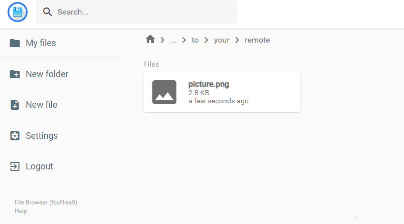

# 使用

## 一个完整的例子

我觉得这个例子可以解决大多数问题：[sample.py](https://github.com/williamfzc/fitch/blob/master/sample/sample.py)

## 创建与销毁

FDevice的使用有两种方式。如果只是简单功能，你可以选择with。它会在使用结束后自动销毁设备：

```python
from fitch.device import safe_device

with safe_device('123456F') as device:
    print(device.device_id)
```

如果你希望自主控制设备：

```python
from fitch.device import FDevice

device = FDevice('123456F')

# do something
print(device.device_id)

# stop your device
device.stop()
```

## 寻找目标

```python
TARGET_PICTURE_PATH = 'path/to/your/picture.png'

point_location = device.find_target(TARGET_PICTURE_PATH)
```

当相似度未达到阈值时，返回None。否则返回坐标。你可以按照下列方法修改阈值（默认0.8）：

```python
from fitch import config
config.CV_THRESHOLD = 0.9
```

另外值得注意，所有配置的修改建议在程序一开始进行，因为一些逻辑会在import的时候就开始了。这很可能导致你的配置修改不生效：

```python
# 修改 python执行器为 python3（默认为python）
from fitch import config
config.DEFAULT_PYTHON_EXECUTOR = 'python3'

# 在修改配置后再进行其他模块的导入，确保所有修改都是生效的
from fitch.device import FDevice
```

当然这么写可能不是很优雅，你可以在自己的程序中琢磨一下怎么设计更好。

## 点击目标

```python
TARGET_PICTURE_PATH = 'path/to/your/picture.png'

result = device.tap_target(TARGET_PICTURE_PATH)
# true or false
```

你可以直接寻找并点击图片。它会返回bool类型的结果，代表操作成功与否。

## 远程模式

基于 [findit](https://github.com/williamfzc/findit)，你可以将目标图片配置到远程，之后直接使用，这样更有利于大量图片的管理。

把图片配置到远程（例子中放置在 `path/to/your/remote` 目录下）：



然后像调用本地图片一样调用它即可：

```python
from fitch import config

# 配置你的findit服务器
config.REMOTE_MODE = True
config.FINDIT_SERVER_IP = '172.17.12.34'
config.FINDIT_SERVER_PORT = 29412

# 直接使用你的远端图片
TARGET_PICTURE_PATH = 'path/to/your/remote/picture.png'
point_location = device.find_target(TARGET_PICTURE_PATH)
```

关于findit服务器配置可参考：https://williamfzc.github.io/findit/#/usage/client+server

## 点击坐标

如果你希望让这一切更加灵活：

```python
point_location = device.find_target(TARGET_PICTURE_PATH)

# some assert to check it?
assert point_location, f'picture {TARGET_PICTURE_PATH} not existed'

# tap it
device.tap_point(point_location)

# or long click?
device.tap_point(point_location, duration=1000)
```

## 界面无关的额外操作

除了ui操作外，我们可能需要一些类似adb的界面无关操作：

```python
device.adb_utils.switch_airplane(True)
```

可以通过 adb_utils 调用 [adbutils](https://github.com/openatx/adbutils) 中的功能。
